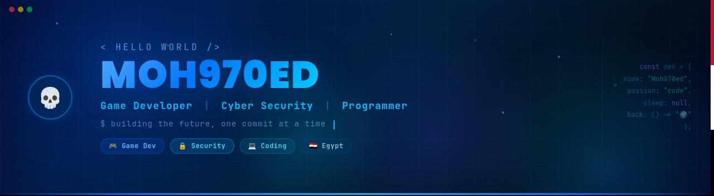

    

## 𝐇𝐞𝐥𝐥𝐨 𝐭𝐡𝐞𝐫𝐞, 𝐟𝐞𝐥𝐥𝐨𝐰 <𝚌𝚘𝚍𝚎𝚛 />! 

> [!CAUTION]
> - 🔖 Congratulations you found me

> [!NOTE]
> - 👨‍💻 I'm currently working on Game Development using `Godot Engine` (Pixel-art & Character mechanics) and Web Technologies.

> [!IMPORTANT]
> - 📚 I'm currently learning and focusing on **Cyber Security (Penetration Testing & Web Vulnerabilities)** and AI
 Agents like **Hermes-Agent** 😅

> [!WARNING] 
> - 💪🏼 Future Goals: Deepen my knowledge in Ethical Hacking and continue creating awesome game systems.

> [!TIP]  
> - 📗 If you're interested in collaborating or have any questions — I'd love to hear from you!

  
  
  
  
  
  
  

<h3 align="center">
   【Ｓｋｉｌｌｓ】  
</h3>

 
  

| **Languages** | **Game Dev & DB** | **Frontend Tools** | **Security & OS** | **Tools** |
| :---: | :---: | :---: | :---: | :---: |
| 
 
| 
  
| 
 
| 
 
| 
 
|
| 
 
| 
 
| 
 
| 
 
| 
 
|
| 
 
| 
 
| 
 
| 
 
| 
 
|
| 
 
| 
 
| 
 
| 
 
| 
 
|
| 
 
| 
 
| 
 
| 
 
| 
 
|

<h3 align="center">
   【My Games & Projects】  
</h3>

> [!NOTE]
> A complete collection of my games and projects.

<!--Project 1 -->

<b>Car-Wash</b> 🚗 ShineHub Car Wash Management System .

  
* [Repo](https://github.com/Moh970ed/Car-Wash)
  

<!--Project 2 -->

<b>AnderMagic</b> The game features engaging gameplay that combines jumping, running, and using magic to defeat enemies and collect coins.

  
* [Repo](https://github.com/Moh970ed/AnderMagic)
  

<!--Project 3 -->

<b>First_Game</b> The first game I made on the (Godot) engine .

  
* [Repo](https://github.com/Moh970ed/First_Game)
  

<!--Project 4 -->

<b>Hide_And_Sink</b>

  
* [Repo](https://mechazen.itch.io/hide-and-sink)
* [Play Now](https://mechazen.itch.io/hide-and-sink)
  

<!--Project 5 -->

<b>ModelScout</b>Your ultimate companion for AI model discovery. A high-speed, ultra-stable tool to explore and audit LLM .

  
* [Repo](https://github.com/Moh970ed/ModelScout)

  

<h3 align="center">
   【Ｓｔａｔｓ】 
</h3>

 

